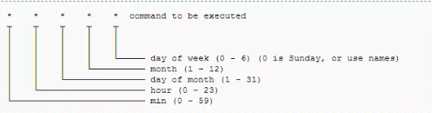

# Solucion Laboratorio 3

## Ejercicio 1: Cron (parte 1)

a)  Definición de daemon: Un **daemon** es un proceso que se ejecuta en segundo plano, el cual tiene como tarea corroborar si existe algun job a ser ejecutado segun el tiempo programado por el usuario.

Dentro del archivo Crontab se encuentran todas las tareas programadas, la sintaxis para poder programar de este archivo sigue la siguiente estructura:

b) Para configurar un cron para ejecutar una tarea todos los jueves de todos los meses a las 22 hs. Los campos más restrictivos son la hora, y el día de la semana. Quedando el cron de la siguiente forma:

    0 22 * * 4 comando

## Ejercicio 2: Cron (parte 2)

a) Se crea y edita el script `script.sh` con el comando 

    vim script.sh

Para que el script agregue una linea al final del archivo `unar1.txt` se usa el comando `echo "una linea" >> unar1.txt` el cual concatena el texto entre comillas al final del archivo indicado.

Es recomendable establecer una carpeta de trabajo, donde se coloca el script y el archivo de texto que creará el crontab. Para saber la ruta al directorio usamos el comando `pwd`, en este caso, todo se guarda dentro del directorio `lab3`

El script quedará así:

    #!/bin/bash 
    echo "una linea" >> /home/santiago/lab3/unar.txt

b) Se le da permisos a todos:

    chmod 777 script.sh

c) Para poder correr el script cada 2 minutos, es lo mismo que ejecutarlo en los minutos pares, para ello se usa la expresion `*/2`. El crontab queda configurado de la siguiente manera:

    #Acceso a editar el crontab 
    crontab -e

    #Configuración del crontab
    */2 * * * * /home/santiago/lab3/script.sh

En caso caso que el crontab no se ejecute bien, es recomendable revisar permisos del script y/o los logs del mismo crontab, dado que puede estarse ejecutando pero los cambios pueden quedar almacenados en otro directorio.
Los logs del cron se pueden consultar con el siguiente comando:

    cat /var/log/syslog | grep cron

Links de interés:

- [Todo sobre Cron y Crontab](https://www.redeszone.net/tutoriales/servidores/cron-crontab-linux-programar-tareas/)
- Editor para corroborar el schedule del cron: [Crontab Guru](https://crontab.guru/)
- [Generador de Crontab](https://crontab-generator.org/)

## Ejercicio 3: IP

Hay diferentes formas de consultar la IP de un equipo, una de ellas es mediante la herramienta `net-tools`, la cual provee el comando `ifconfig`, el cual se usará para saber la IP del equipo.

### Instalacion de net-tools (en caso que no se tenga)

#### Ubuntu / Debian distros (apt)

    sudo apt update && apt upgrade -y
    sudp apt install net-tools

#### Centos (yum)

    sudo yum install net-tools   

#### Arch (pacman)

    sudo pacman -Syy
    sudo pacman -S net-tools

## Ejercicio 4: Ping

Se puede checkear si el equipo tiene conectividad con una determinada ip mediante:

    ping (ip a checkear)

Por ejemplo, podemos checkear que tenemos conexión con el servidor dns de Google mediante:

    ping 8.8.8.8

Para terminar la transmisión de datos: `Ctrl + C`, luego se muestra la cantidad de paquetes transmitidos y paquetes perdidos.

## Ejercicio 5: Conexión SSH

La conexion SSH (o Secure SHell) facilita las comunicaciones seguras entre dos sistemas mediente una arquitectura cliente/servidor y permite a los usuarios una conexion remota a un host.

para conectarse a un host remoto es necesario que el servidor cuente con un servicio SSH ya configurado (ya sea para conexiones mediante nombre y contraseña o mediante claves SSH). Luego se puede ejecutar (en nuestro equipo): 

    ssh user@ipServidor

Asumimos que el servidor utiliza el puerto por defecto (puerto 22), de no ser así es posible indicar el puerto mediante `ssh -p 2222 user@ipServidor`

## Ejercicio 6: Usuarios e identificacion de procesos

Haremos lo siguiente:

    # Crea a, recordar el UID que nos asigna el sistema
    sudo adduser a 
    
    # Crea b
    sudo adduser b

    # Crea c
    sudo adduser c

    # Se dan al usuario c permisos sudo para poder matar procesos
    sudo adduser c sudo 

    # Login como a
    su a

    # Login como b
    su b 

    # Login como c
    su c

    # Vemos todos los procesos activos
    ps all 

    # El proceso que corresponde al usuario a es el que lleva su UID (User ID), se identifica el PPID/PID 
    sudo kill <PID>

## Ejercicio 7: Procesos

Para poder ver los procesos se tira el comando `ps all`

a) Se puede matar procesos con el comando `kill <PID>`  
b) Esto se hace mediante `ps all`, luego se busca el proceso de la otra consola, su PID y luego se mata el proceso mediante `kill <PID>`

## Ejercicio 8: Compresion de archivos

    echo "Dulce de Leche >>> Nutella" >> facts.txt
    mkdir docs
    tar -cvf comprimir.tar facts.txt
    mv comprimir.tar  ./docs/
    tar -xvf ./docs/comprimir.tar

## Ejercicio 9: Viendo repositorios

Los repositorios del sistema generalmente se encuentran en `/etc/apt/sources.list`, para poder ver este archivo se usa `cat`

    cat /etc/apt/sources.list